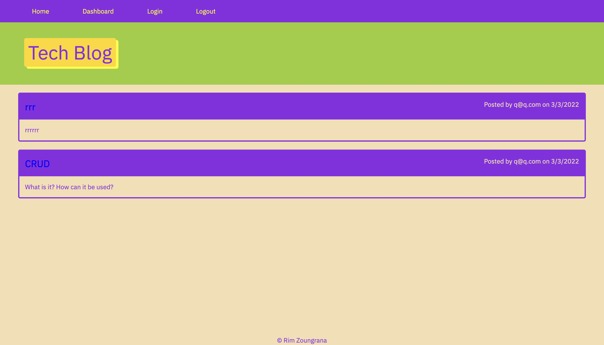

# Tech Blog

## License

## Screenshot

## Description
This is a tech blog where users can manipulate the application using CRUD. They can add as many posts as they want or delete these same posts. They can also create an account and log in whenever they want. 

## Usage
To be able to use the application, the user has to install few dependencies such as path, express, handlebars

## Developer
- Rim Zoungrana
- github.com/Shalah